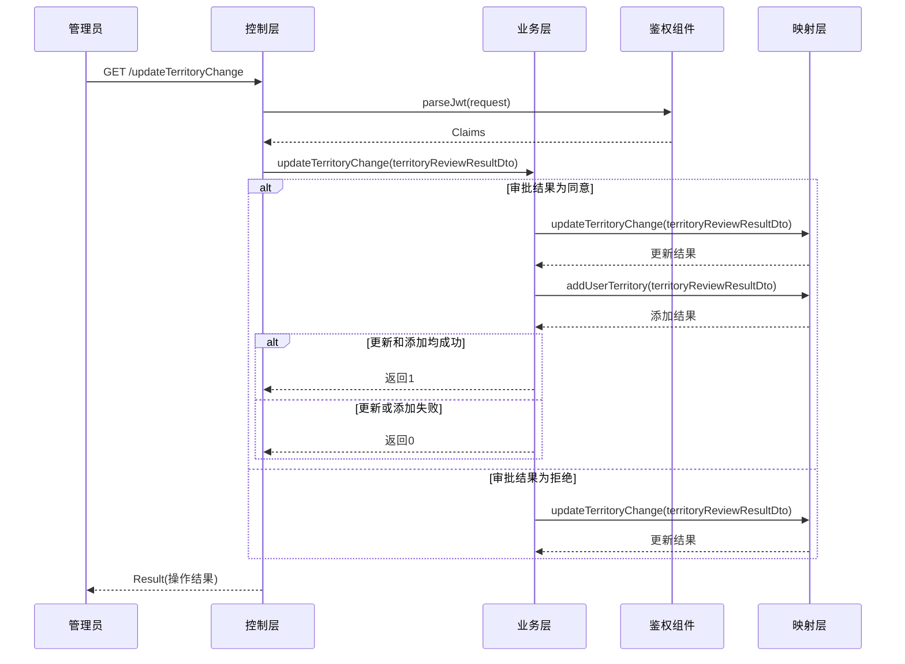

# 毕业设计:吸烟检测项目 Java后端

## 技术栈:
- Vue.js
- FastApi
- SpringBoot/AutumnFramework(可以试试)
- Redis
- Mysql
- 
## 说明:
- 要是有时间会迁移到AutumnFramework
## 更新日志
2024/3/12
- 增加了部分鉴权组件,一开始想用拦截器鉴权后通过Session像Controller传参,但是前端不传递Cookie,开启之后跨域又不能用*得指定跨域范围,而且每次的JsessionId都不一样导致spring给的sessionid也不一样,依然拿不到数据,于是想着自建一个StringPair类在拦截器中手动像Controller注入参数但是貌似无法实现,剩下只有Aop一条路但是改代码太麻烦最终选择写一个工具类二次解析Jwt

2024/3/14
- 辖区相关的接口补全,swagger可以正常用了

